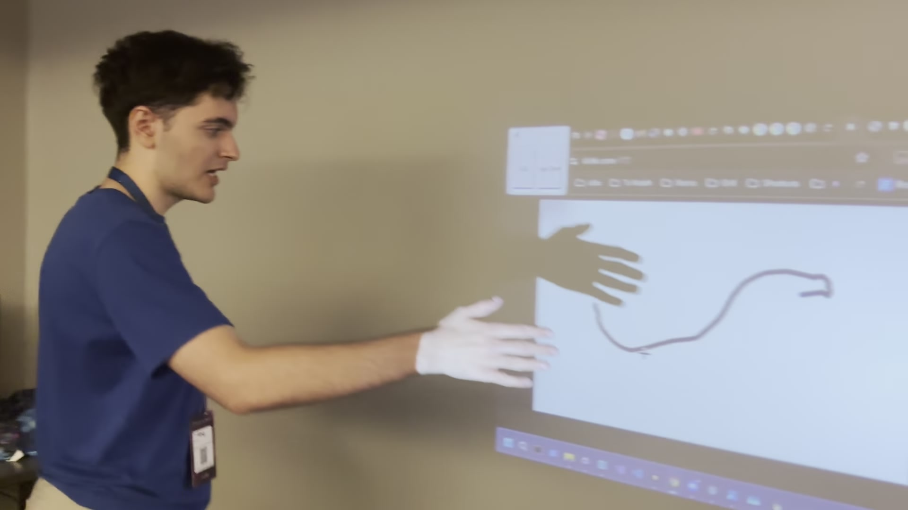

# HTN25 - Stereo Vision Touch Surface

Turn any projector into a touch surface using two Raspberry Pi cameras and a
Windows laptop. The system detects a fingertip (or ball) in stereo, triangulates
its 3D position, intersects it with the projected screen plane, and injects the
hit as a native Windows touch event. Mouse input is used as a fallback.

Built for Hack the North 2025.

## Demo

[](https://www.youtube.com/watch?v=SSErUJJCi6A)

[Watch the Jarvis Lite demo](https://www.youtube.com/watch?v=SSErUJJCi6A): drawing
on the wall, the stereo camera and projector setup, and ArUco calibration.
Preview from the team's demo, uploaded by Kev D. See the
[Devpost project](https://devpost.com/software/touch-me) for the build and team.

## What it does

The core problem: projectors are cheap and everywhere, but they are not
interactive. Making a wall or table projected surface touch-sensitive usually
means buying an expensive touch frame or a special short-throw interactive
projector. This project replaces that hardware with computer vision.

A laptop runs a projector. A Raspberry Pi 5 with two Pi cameras watches the
projected surface from the side. By treating the two cameras as a stereo pair,
the system can recover depth for anything in front of the screen, figure out
where a finger or ball crosses the screen plane, and report that point back to
the laptop so it becomes a real touch.

The pipeline:

1. The projector displays a calibration image: a mostly white screen filled with
   ArUco markers (`new_rasp/aruco_grid.png`).
2. Both Pi cameras capture the calibration image. The marker positions are used
   to solve the stereo calibration, recover the screen plane in 3D, and map
   projector pixels to the plane.
3. During play, the projected screen is subtracted from the camera view so that
   anything remaining is "not screen", i.e. a hand, finger, or ball in front of
   the surface.
4. The object's 3D position is triangulated from the two camera views, projected
   onto the screen plane, and converted to projector pixel coordinates.
5. Those coordinates are sent to the laptop and injected as native Windows touch
   events (with a mouse fallback).

## Key features

- **Stereo 3D reconstruction** from two Pi cameras using OpenCV calibration and
  triangulation (`new_rasp/stereo_utils.py`, `new_rasp/stereo_utils.py`).
- **ArUco-based calibration** that solves the projector-to-screen mapping and
  the screen plane in one shot (`new_rasp/calibrate_projector_corners_stereo.py`).
- **Ball and fingertip tracking** with foreground subtraction against the known
  screen image (`new_rasp/stereo_ball_tracker.py`).
- **Hand and gesture recognition** via MediaPipe (pinch, thumbs up/down,
  index-pointing) on top of the model's built-in gestures (`ges.py`,
  `new_rasp/gesture_recognition.py`).
- **FastAPI coordination server** that holds the latest calibration and the
  latest tracked ball/touch sample, and exposes simple endpoints the game client
  polls (`server.py`).
- **Unity game client** that consumes touch positions and drives an interactive
  scene (`Scripts/`, C#).

## Tech stack

- **Vision and math**: Python 3.12, OpenCV, NumPy, MediaPipe Tasks
  (gesture recognizer and hand landmarker `.task` models).
- **Server**: FastAPI + Uvicorn.
- **Camera capture**: Raspberry Pi 5 with two Pi cameras, streamed over RTSP
  and read through `new_rasp/streamcam.py`.
- **Game / client**: Unity (C#), talking to the Python server over HTTP.
- **Hardware**: projector, Windows 11 laptop, Raspberry Pi 5, two Pi cameras.

## Repository layout

- `server.py` - FastAPI server: calibration endpoints, ball/touch sample
  buffer, projector corner serving.
- `ges.py` - standalone gesture recognition demo over a webcam.
- `new_rasp/` - the vision core: stereo calibration, ArUco detection, stereo
  ball tracking, hand tracking, gesture recognition, and stream helpers.
- `Scripts/` - Unity C# game logic: calibration polling, server API client,
  player and interaction handling.
- `test/` - small live-test scripts for stereo hand tracking and screen
  tracking.

## How to run

Prerequisites: Python 3.12 on the laptop, a Raspberry Pi 5 with two Pi cameras
streaming over RTSP, and the projector connected to the laptop.

1. Install Python dependencies on the laptop:

   ```bash
   uv pip install fastapi uvicorn opencv-python numpy mediapipe
   ```

   The MediaPipe `.task` model files (`gesture_recognizer.task`,
   `hand_landmarker.task`) auto-download on first run via each script's
   `ensure_model()` helper; no manual setup is required.

2. Start the Pi cameras streaming RTSP (one stream per camera). Update the
   stream URLs in `new_rasp/calibrate_projector_corners_stereo.py`
   (`DEFAULT_URL1`, `DEFAULT_URL2`) if your addresses differ.

3. Start the coordination server on the laptop:

   ```bash
   py server.py
   ```

   It listens on port 8000.

4. Trigger calibration. The projector must be showing the ArUco grid:

   ```bash
   curl -X POST http://127.0.0.1:8000/calibrate_projector
   ```

   Poll `/is_calibrated` until it returns true. The result is cached and also
   written to `new_rasp/screen_corners_3d.json`.

5. Open the Unity project and press Play. The game polls `/get_ball` for the
   latest touch sample and renders the interactive scene on the projector.

## Notes

- Touch injection targets native Windows touch events; if the touch path fails
  on a given machine, the system falls back to emulated mouse input.
- Calibration assumes the two cameras can both see the full projected screen
  and the ArUco grid. Lighting changes can shift the foreground-subtraction
  baseline, so the ball tracker recomputes a darkest-pixel baseline per camera.
- This was built under hackathon time pressure and is a working prototype, not
  a polished product.

## License

MIT License, see [LICENSE](LICENSE).
